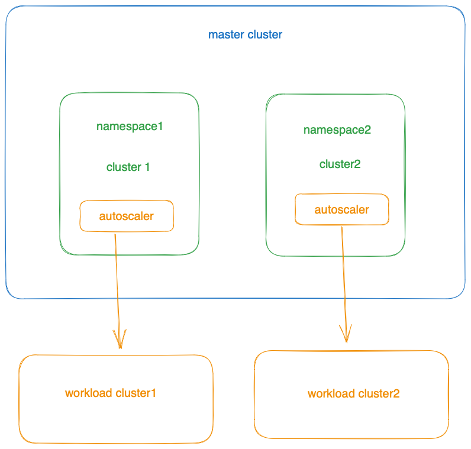
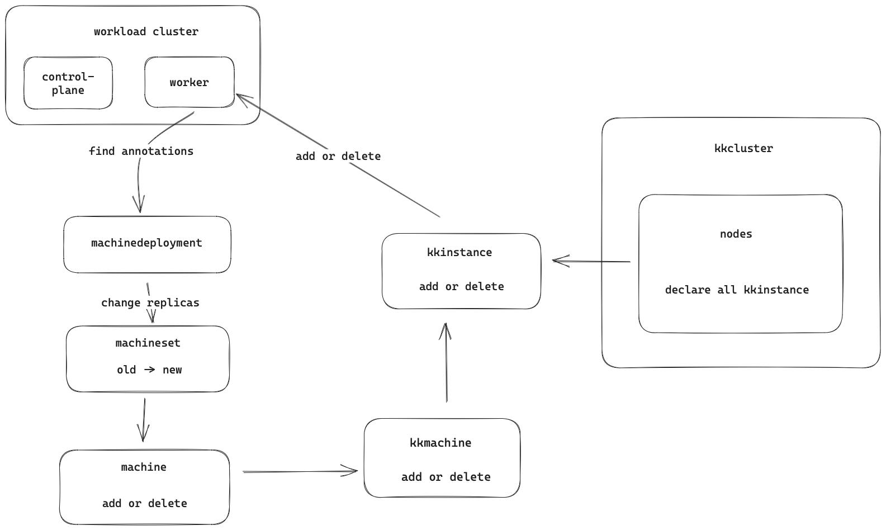

# Cluster-Autoscaler for capkk
refer to https://cluster-api.sigs.k8s.io/tasks/automated-machine-management/autoscaling.html
capkk is the infrastructure cluster for clusterapi.Here is an example of deploying Cluster Autoscaler in capkk.

## Deployment plan



1. Install the autoscaler on the master cluster to manage the dynamic scaling of the workload cluster.
2. Install the autoscaler and the cluster it manages in the same namespace.

## Scaling mechanism



⚠️ **Automatic scaling is only supported for worker nodes.**

1. Configure all scalable machines on the nodes of the kkcluster.

```yaml
apiVersion: infrastructure.cluster.x-k8s.io/v1beta1
kind: KKCluster
metadata:
  name: capkk-1
  namespace: default
spec:
  component:
    zone: cn
  controlPlaneLoadBalancer:
    host: 172.31.53.163
  nodes:
    auth:
      password: "123456"
      user: root
    instances:
    - address: 172.31.53.163
    - address: 172.31.53.160
    - address: 172.31.53.122
```

2. Configure annotations on the machinedeployment to allow the autoscaler to discover node groups.

```yaml
apiVersion: cluster.x-k8s.io/v1beta1
kind: MachineDeployment
metadata:
  annotations:
    cluster.x-k8s.io/cluster-api-autoscaler-node-group-max-size: "3"
    cluster.x-k8s.io/cluster-api-autoscaler-node-group-min-size: "0"
    capacity.cluster-autoscaler.kubernetes.io/memory: "16G"
    capacity.cluster-autoscaler.kubernetes.io/cpu: "8"
  name: capkk-1-md-0
  namespace: default
spec:
  clusterName: capkk-1
  replicas: 1
  selector:
    matchLabels: null
  template:
    spec:
      bootstrap:
        configRef:
          apiVersion: bootstrap.cluster.x-k8s.io/v1beta1
          kind: KubeadmConfigTemplate
          name: capkk-1-md-0
      clusterName: capkk-1
      infrastructureRef:
        apiVersion: infrastructure.cluster.x-k8s.io/v1beta1
        kind: KKMachineTemplate
        name: capkk-1-md-0
      version: v1.25.4
```

When `cluster.x-k8s.io/cluster-api-autoscaler-node-group-min-size` is set to "0", it indicates that the minimum number of worker nodes is 0. In this case, it is necessary to set `capacity.cluster-autoscaler.kubernetes.io/memory` and `capacity.cluster-autoscaler.kubernetes.io/cpu`.

3. Modify the startup parameters in the autoscaler deployment

```yaml
---
apiVersion: apps/v1
kind: Deployment
metadata:
  name: cluster-autoscaler
  labels:
    app: cluster-autoscaler
spec:
  selector:
    matchLabels:
      app: cluster-autoscaler
  replicas: 1
  template:
    metadata:
      labels:
        app: cluster-autoscaler
    spec:
      containers:
        - image: registry.k8s.io/autoscaling/cluster-autoscaler:v1.26.3
          name: default
          command:
            - /cluster-autoscaler
          args:
            - --cloud-provider=clusterapi
            - --kubeconfig=/tmp/kubeconfig/workload.conf
            - --clusterapi-cloud-config-authoritative
            - --node-group-auto-discovery=clusterapi:namespace=${NAMESPACE}
            - --scale-down-enabled=false
          volumeMounts:
            - mountPath: /tmp/kubeconfig
              name: workload-kubeconfig
      serviceAccountName: cluster-autoscaler
      terminationGracePeriodSeconds: 10
      tolerations:
        - effect: NoSchedule
          key: node-role.kubernetes.io/master
      volumes:
        - name: workload-kubeconfig
          secret:
            secretName: '${CLUSTER_NAME}-kubeconfig'
            optional: true
            items:
              - key: value
                path: workload.conf
---
kind: RoleBinding
apiVersion: rbac.authorization.k8s.io/v1
metadata:
  name: cluster-autoscaler-management
roleRef:
  apiGroup: rbac.authorization.k8s.io
  kind: Role
  name: cluster-autoscaler-management
subjects:
  - kind: ServiceAccount
    name: cluster-autoscaler
    namespace: '${NAMESPACE}'
---
apiVersion: v1
kind: ServiceAccount
metadata:
  name: cluster-autoscaler
---
kind: Role
apiVersion: rbac.authorization.k8s.io/v1
metadata:
  name: cluster-autoscaler-management
rules:
  - apiGroups:
      - cluster.x-k8s.io
    resources:
      - machinedeployments
      - machinedeployments/scale
      - machines
      - machinesets
    verbs:
      - get
      - list
      - update
      - watch
  - apiGroups:
      - infrastructure.cluster.x-k8s.io
    resources:
      - kkmachinetemplates
    verbs:
      - get
      - list
      - update
      - watch
```

**ScalingUp**：Triggered when there are no nodes available for scheduling pods.

**ScalingDown**: Configure it in the startup parameters of the autoscaler. For the complete configuration, please refer to the official website of the autoscaler.
