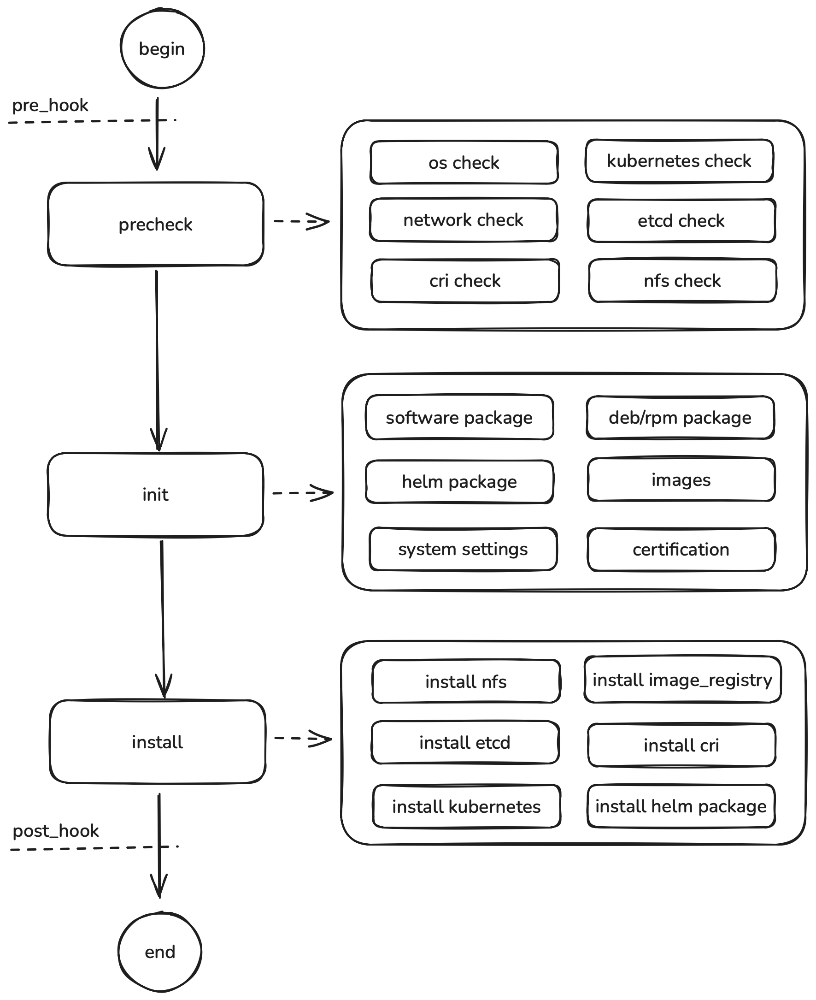

# architecture

## pre_hook

The pre_hook allows users to execute scripts on the corresponding nodes before creating the cluster.

Execution flow:
1. Copy local scripts to remote nodes at `/etc/kubekey/scripts/pre_install_{{ .inventory_hostname }}.sh`
2. Set the script file permission to 0755
3. Iterate over all `pre_install_*.sh` files in `/etc/kubekey/scripts/` on each remote node and execute them

> **work_dir**: working directory, defaults to the current command execution directory.  
> **inventory_hostname**: the host name defined in the inventory.yaml file.

## precheck

The precheck phase verifies that cluster nodes meet the installation requirements.

**os_precheck**: OS checks, including:
- **Hostname check**: Verify that the hostname format is valid (contains only lowercase letters, digits, '.', or '-', and must start and end with a letter or digit)
- **OS version check**: Verify that the current OS is in the supported OS distribution list, unless unsupported distributions are allowed
- **Architecture check**: Verify that the system architecture is supported (amd64 or arm64)
- **Memory check**: 
  - Master nodes: verify memory meets the minimum master node requirement
  - Worker nodes: verify memory meets the minimum worker node requirement
- **Kernel version check**: Verify that the kernel version meets the minimum requirement
**kubernetes_precheck**: Kubernetes-related checks, including:
- **IP address check**: Verify that the node defines either internal_ipv4 or internal_ipv6, neither can be empty
- **KubeVIP check**: When using kube_vip as the control plane endpoint, verify that the kube_vip address is valid and not in use
- **Kubernetes version check**: Verify that the Kubernetes version meets the minimum requirement
- **Installed Kubernetes check**: Verify whether Kubernetes is already installed; if installed, check that the version matches the configured kube_version
**network_precheck**: Network connectivity checks, including:
- **Network interface check**: Verify that the node has the configured IPv4 or IPv6 network interfaces
- **CIDR configuration check**: Verify that Pod CIDR and Service CIDR are properly formatted (supports dual-stack: ipv4_cidr/ipv6_cidr or ipv4_cidr,ipv6_cidr)
- **Dual-stack support check**: When using dual-stack networking, verify that Kubernetes version supports it (v1.20.0+)
- **Network plugin check**: Verify that the configured network plugin is supported
- **Network address space check**: Ensure the node has enough network address space to accommodate the maximum number of pods
- **Hybridnet version check**: When using the Hybridnet network plugin, verify that Kubernetes version meets requirements (v1.16.0+)
**etcd_precheck**: etcd cluster checks, including:
- **Deployment type check**: Validate etcd deployment type (internal or external), and ensure external etcd group is not empty and node count is odd
- **Disk IO performance check**: Use fio to test write latency on etcd data disks, ensuring disk sync latency (e.g., WAL fsync) meets cluster requirements
- **Installed etcd check**: Check whether etcd is already installed on the host
**cri_precheck**: Container runtime checks, including:
- **Container manager check**: Verify that the configured container manager is supported (docker or containerd)
- **containerd version check**: When using containerd, verify that the version meets the minimum requirement
**nfs_precheck**: NFS storage checks, including:
- **NFS server count check**: Verify that there is only one NFS server node in the cluster to ensure uniqueness of NFS deployment
**image_registry_precheck**: Image registry checks, including:
- **Required software check**: Verify that `docker_version` and `dockercompose_version` are configured and not empty. The image registry is installed via docker_compose, missing required software will cause failure.

## init

The init phase prepares and constructs all resources required for cluster installation, including:
- **Package download**: Download binaries for Kubernetes, container runtimes, network plugins, and other core components
- **Helm chart preparation**: Fetch and verify Helm charts for subsequent application deployment
- **Container image pull**: Download Docker images required by cluster components
- **Offline package construction**: When performing offline installation, package all dependencies (binaries, images, charts, etc.) into a complete offline package
- **Certificate management**: Generate certificates required for cluster installation and inter-component communication, including CA and service certificates

## install

The install phase is the core of KubeKey, responsible for deploying and configuring the Kubernetes cluster on the nodes, including:

**install nfs**: Install NFS service on nodes in the `nfs` group.  
**install image_registry**: Install an image registry on nodes in the `image_registry` group. Currently supports harbor and registry.  
**install etcd**: Install etcd on nodes in the `etcd` group.  
**install cri**: Install container runtime on nodes in the `k8s_cluster` group. Supports docker and containerd.  
**kubernetes_install**: Install Kubernetes on nodes in the `k8s_cluster` group.  
**install helm**: Install additional Helm applications on the existing Kubernetes cluster, including CNI plugins (calico, cilium, flannel, hybridnet, kubeovn, multus)

## post_hook

The post_hook phase executes after cluster installation, handling final configuration and validation:

Execution flow:
1. Copy local scripts to remote nodes at `/etc/kubekey/scripts/post_install_{{ .inventory_hostname }}.sh`
2. Set the script file permission to 0755
3. Iterate over all `post_install_*.sh` files in `/etc/kubekey/scripts/` on each remote node and execute them

> **work_dir**: working directory, defaults to the current command execution directory.  
> **inventory_hostname**: the host name defined in the inventory.yaml file.
