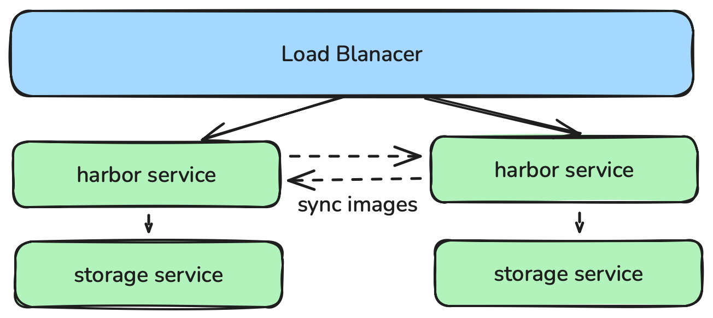

# image_registry

The image_registry module allows users to install an image registry. It supports both `harbor` and `docker-registry` types.

## Requirements

- One or more computers running a Linux OS compatible with deb/rpm, e.g., Ubuntu or CentOS.
- Each machine should have at least 8 GB of memory; insufficient memory may limit application performance.
- Control plane nodes should have at least 4 CPU cores.
- Full network connectivity between all machines in the cluster. You can use public or private networks.
- When using local storage, each machine should have 100 GB of high-speed disk space.

## Install Harbor

### Build Inventory
```yaml
apiVersion: kubekey.kubesphere.io/v1
kind: Inventory
metadata:
  name: default
spec:
  hosts: # You can set all nodes here or assign nodes to specific groups.
#    node1:
#      connector:
#        type: ssh
#        host: node1
#        port: 22
#        user: root
#        password: 123456
  groups:
    # all Kubernetes nodes
    k8s_cluster:
      groups:
        - kube_control_plane
        - kube_worker
    # control plane nodes
    kube_control_plane:
      hosts:
        - localhost
    # worker nodes
    kube_worker:
      hosts:
        - localhost
    # etcd nodes when etcd_deployment_type is external
    etcd:
      hosts:
        - localhost
    image_registry:
      hosts:
       - localhost
    # nfs nodes for registry storage and Kubernetes NFS storage
#    nfs:
#      hosts:
#        - localhost
```
Set the `image_registry` group.

### Installation
Harbor is the default image registry.

1. Precheck before installation
```shell
kk precheck image_registry -i inventory.yaml --set harbor_version=v2.10.2,docker_version=24.0.7,dockercompose_version=v2.20.3
```

2. Installation
- Standalone installation
`image_registry` can be installed independently of the cluster.
```shell
kk init registry -i inventory.yaml --set harbor_version=v2.10.2,docker_version=24.0.7,dockercompose_version=v2.20.3
```

- Automatic installation during cluster creation
When creating a cluster, KubeKey will detect if `harbor` is installed on `image_registry` nodes; if not, it will install `harbor` based on configuration.
```shell
kk create cluster -i inventory.yaml --set harbor_version=v2.10.2,docker_version=24.0.7,dockercompose_version=v2.20.3
```

### Harbor High Availability

Harbor HA can be implemented in two ways:

1. All Harbor instances share a single storage service.
Official method, suitable for installation within a Kubernetes cluster. Requires separate PostgreSQL and Redis services.  
Reference: https://goharbor.io/docs/edge/install-config/harbor-ha-helm/

2. Each Harbor has its own storage service.
KubeKey method, suitable for server deployment.

- load balancer: implemented via Docker Compose deploying keepalived.
- harbor service: implemented via Docker Compose deploying Harbor.
- sync images: achieved using Harbor replication.

Installation example:
```shell
./kk init registry -i inventory.yaml --set image_registry.ha_vip=xx.xx.xx.xx --set harbor_version=v2.10.2,docker_version=24.0.7,dockercompose_version=v2.20.3 --set keepalived_version=2.0.20,artifact.artifact_url.keepalived.amd64=keepalived-2.0.20-linux-amd64.tgz
```

Steps:
1. Set multiple nodes in the `image_registry` group in the inventory.
2. Set `image_registry.ha_vip`, which is the entry for load balancing.
3. Set `keepalived_version` and `artifact.artifact_url.keepalived.amd64`. Keepalived is used for load balancing. KubeKey does not provide a download address, so you need to manually package it.
```shell
# download keepalived images
docker pull osixia/keepalived:{{ .keepalived_version }}
# package image
docker save -o keepalived-{{ .keepalived_version }}-linux-{{ .binary_type }}.tgz osixia/keepalived:{{ .keepalived_version }}
# move image to workdir
mv keepalived-{{ .keepalived_version }}-linux-{{ .binary_type }}.tgz {{ .binary_dir }}/image-registry/keepalived/{{ .keepalived_version }}/{{ .binary_type }}/
```
- `binary_type`: machine architecture (currently supports amd64 and arm64, auto-detected via `gather_fact`)  
- `binary_dir`: software package storage path, usually `{{ .work_dir }}/kubekey`.

4. Set `harbor_version`, `docker_version`, and `dockercompose_version`. Harbor is installed via Docker Compose.

## Install Registry

### Build Inventory
```yaml
apiVersion: kubekey.kubesphere.io/v1
kind: Inventory
metadata:
  name: default
spec:
  hosts: # You can set all nodes here or assign nodes to specific groups.
#    node1:
#      connector:
#        type: ssh
#        host: node1
#        port: 22
#        user: root
#        password: 123456
  groups:
    k8s_cluster:
      groups:
        - kube_control_plane
        - kube_worker
    kube_control_plane:
      hosts:
        - localhost
    kube_worker:
      hosts:
        - localhost
    etcd:
      hosts:
        - localhost
    image_registry:
      hosts:
       - localhost
#    nfs:
#      hosts:
#        - localhost
```

### Build Registry Image Package
KubeKey does not provide an offline registry image package. Manual packaging is required.
```shell
# download registry images
docker pull registry:{{ .docker_registry_version }}
# package image
docker save -o docker-registry-{{ .docker_registry_version }}-linux-{{ .binary_type }}.tgz registry:{{ .docker_registry_version }}
# move image to workdir
mv docker-registry-{{ .docker_registry_version }}-linux-{{ .binary_type }}.tgz {{ .binary_dir }}/image-registry/docker-registry/{{ .docker_registry_version }}/{{ .binary_type }}/
```
- `binary_type`: machine architecture (amd64 or arm64, auto-detected via `gather_fact`)  
- `binary_dir`: software package storage path, usually `{{ .work_dir }}/kubekey`.

### Installation
Set `image_registry.type` to `docker-registry` to install the registry.

1. Precheck
```shell
kk precheck image_registry -i inventory.yaml --set image_registry.type=docker-registry --set docker_registry_version=2.8.3,docker_version=24.0.7,dockercompose_version=v2.20.3
```

2. Installation
- Standalone installation
```shell
kk init registry -i inventory.yaml --set image_registry.type=docker-registry --set docker_registry_version=2.8.3,docker_version=24.0.7,dockercompose_version=v2.20.3 --set artifact.artifact_url.docker_registry.amd64=docker-registry-2.8.3-linux.amd64.tgz
```

- Automatic installation during cluster creation
```shell
kk create cluster -i inventory.yaml --set image_registry.type=docker-registry --set docker_registry_version=2.8.3,docker_version=24.0.7,dockercompose_version=v2.20.3 --set artifact.artifact_url.docker_registry.amd64=docker-registry-2.8.3-linux.amd64.tgz
```

### Registry High Availability


- load balancer: implemented via Docker Compose deploying keepalived.
- registry service: implemented via Docker Compose deploying the registry.
- storage service: Registry HA can be achieved using shared storage. Docker Registry supports multiple storage backends, including:
  - **filesystem**: local storage. By default, Docker Registry uses local disk. For HA, mount the local directory to NFS or other shared storage. Example:
      ```yaml
      image_registry:
        docker_registry:
          storage:
            filesystem:
              rootdir: /opt/docker-registry/data
              nfs_mount: /repository/docker-registry # optional, mount rootdir to NFS
      ```
      Ensure all registry nodes have consistent data via shared storage.

  - **azure**: Azure Blob Storage as backend. Suitable for Azure cloud deployments. Example:
      ```yaml
      image_registry:
        docker_registry:
          storage:
            azure:
              accountname: <your-account-name>
              accountkey: <your-account-key>
              container: <your-container-name>
      ```

  - **gcs**: Google Cloud Storage as backend. Suitable for GCP deployments. Example:
      ```yaml
      image_registry:
        docker_registry:
          storage:
            gcs:
              bucket: <your-bucket-name>
              keyfile: /path/to/keyfile.json
      ```

  - **s3**: Amazon S3 or S3-compatible storage. Suitable for AWS or private clouds. Example:
      ```yaml
      image_registry:
        docker_registry:
          storage:
            s3:
              accesskey: <your-access-key>
              secretkey: <your-secret-key>
              region: <your-region>
              bucket: <your-bucket-name>
      ```

> **Note:**  
> 1. For shared storage (NFS, S3, GCS, Azure Blob), deploy at least 2 registry instances with load balancing (e.g., keepalived+nginx) for HA access.  
> 2. Ensure read/write permissions and network connectivity for all registry nodes to the shared storage.  
