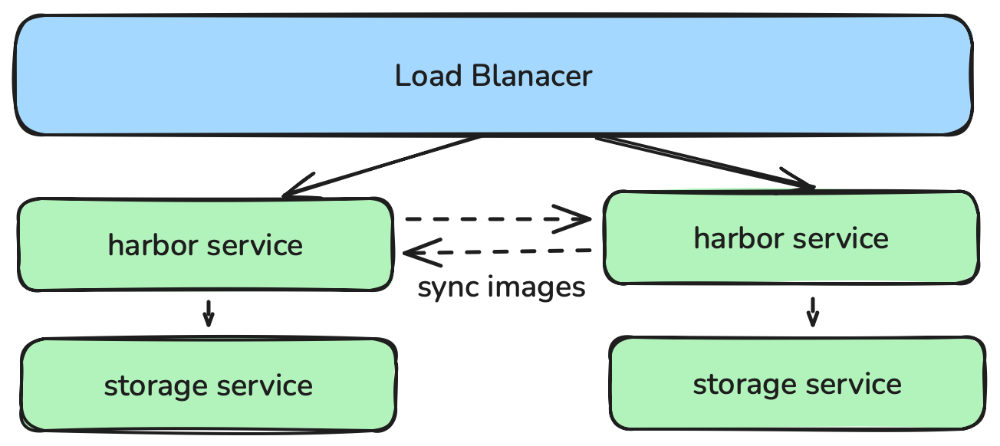
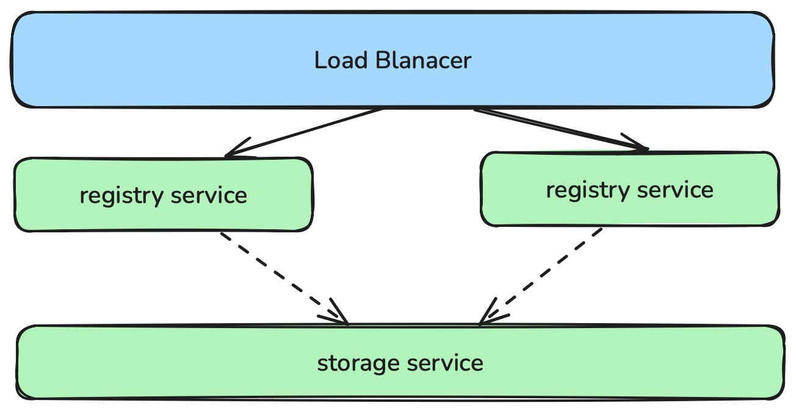

# image_registry

image_registry允许用户安装镜像仓库。支持`harbor`和`docker-registry`两种类型

## requirement

- 一台或多台运行兼容 deb/rpm 的 Linux 操作系统的计算机；例如：Ubuntu 或 CentOS。
- 每台机器 8 GB 以上的内存，内存不足时应用会受限制。
- 用作控制平面节点的计算机上至少有 4 个 CPU。
- 集群中所有计算机之间具有完全的网络连接。你可以使用公共网络或专用网络
- 使用本地存储时。计算机需要100G高速存储的磁盘空间。  

## 安装harbor

### 构建Inventory
```yaml
apiVersion: kubekey.kubesphere.io/v1
kind: Inventory
metadata:
  name: default
spec:
  hosts: # your can set all nodes here. or set nodes on special groups.
#    node1:
#      connector:
#        type: ssh
#        host: node1
#        port: 22
#        user: root
#        password: 123456
  groups:
    # all kubernetes nodes.
    k8s_cluster:
      groups:
        - kube_control_plane
        - kube_worker
    # control_plane nodes
    kube_control_plane:
      hosts:
        - localhost
    # worker nodes
    kube_worker:
      hosts:
        - localhost
    # etcd nodes when etcd_deployment_type is external
    etcd:
      hosts:
        - localhost
    image_registry:
      hosts:
       - localhost
    # nfs nodes for registry storage. and kubernetes nfs storage
#    nfs:
#      hosts:
#        - localhost

```
需设置 `image_registry` 组

### 安装
harbor是默认安装的镜像仓库
1. 安装前检查
    ```shell
    kk precheck image_registry -i inventory.yaml --set harbor_version=v2.10.2,docker_version=24.0.7,dockercompose_version=v2.20.3
    ```
2. 安装
- 单独安装
`image_registry` 可以脱离集群单独进行安装。
    ```shell
    kk init registry -i inventory.yaml --set harbor_version=v2.10.2,docker_version=24.0.7,dockercompose_version=v2.20.3
    ```

- 在创建集群时，自动安装
在创建集群时，会检测 `image_registry` 节点是否安装了`harbor`, 没有安装时会自动根据配置安装`harbor`。
    ```shell
    kk create cluster -i inventory.yaml --set harbor_version=v2.10.2,docker_version=24.0.7,   dockercompose_version=v2.20.3
    ```

### harbor高可用

harbor高可用有两种实现方式。

1. 每个harbor共享同一个存储服务。
官方做法，适用于在kubernetes集群中安装。需要独立部署PostgreSQL 和 Redis 服务    
参考：https://goharbor.io/docs/edge/install-config/harbor-ha-helm/

2. 每个harbor有单独的存储服务。
kubekey的做法，适用于在服务器上安装。

- load balancer: 通过docker compose部署keepalived服务实现。
- harbor service: 通过docker compose部署harbor实现。
- sync images: 通过harbor的复制管理功能实现。

安装示例:
```shell
./kk init registry -i inventory.yaml --set image_registry.ha_vip=xx.xx.xx.xx --set harbor_version=v2.10.2,docker_version=24.0.7,dockercompose_version=v2.20.3 --set keepalived_version=2.0.20,artifact.artifact_url.keepalived.amd64=keepalived-2.0.20-linux-amd64.tgz
```
1. 在inventory中的image_registry 组中设置多个节点
   
2. 设置变量`image_registry.ha_vip` ha_vip 是负载均衡的入口
   
3. 设置变量 `keepalived_version` 和 `artifact.artifact_url.keepalived.amd64` keepalived 是用于负载均衡的镜像。目前kubekey并未提供下载地址，可通过手动打包的方式来实现。
    ```shell
    # download keepalived images
    docker pull osixia/keepalived:{{ .keepalived_version }}
    # package image
    docker save -o keepalived-{{ .keepalived_version }}-linux-{{ .binary_type }}.tgz osixia/  keepalived:{{ .keepalived_version }}
    # move image to workdir
    mv keepalived-{{ .keepalived_version }}-linux-{{ .binary_type }}.tgz {{ .binary_dir }}/ image-registry/keepalived/{{ .keepalived_version }}/{{ .binary_type }}/
    ```
    `binary_type`: 是机器的架构（目前支持amd64和arm64，可通过 `gather_fact` 自动获取）  
    `binary_dir`: 软件包存放地址，通常为: `{{ .work_dir}}/kubekey`  

4. 设置变量 `harbor_version`, `docker_version` 和 `dockercompose_version`。harbor通过docker-compose进行安装。


## 安装registry

### 构建Inventory
```yaml
apiVersion: kubekey.kubesphere.io/v1
kind: Inventory
metadata:
  name: default
spec:
  hosts: # your can set all nodes here. or set nodes on special groups.
#    node1:
#      connector:
#        type: ssh
#        host: node1
#        port: 22
#        user: root
#        password: 123456
  groups:
    # all kubernetes nodes.
    k8s_cluster:
      groups:
        - kube_control_plane
        - kube_worker
    # control_plane nodes
    kube_control_plane:
      hosts:
        - localhost
    # worker nodes
    kube_worker:
      hosts:
        - localhost
    # etcd nodes when etcd_deployment_type is external
    etcd:
      hosts:
        - localhost
    image_registry:
      hosts:
       - localhost
    # nfs nodes for registry storage. and kubernetes nfs storage
#    nfs:
#      hosts:
#        - localhost

```
### 构建 registry 镜像包
kubekey暂未提供registry的离线镜像包地址，需通过手动打包的方式来实现。
    ```shell
    # download registry images
    docker pull registry:{{ .docker_registry_version }}
    # package image
    docker save -o docker-registry-{{ .docker_registry_version }}-linux-{{ .binary_type }}.tgz registry:{{ .docker_registry_version }}
    # move image to workdir
    mv docker-registry-{{ .docker_registry_version }}-linux-{{ .binary_type }}.tgz {{ .binary_dir }}/ image-registry/docker-registry/{{ .docker_registry_version }}/{{ .binary_type }}/
    ```
    `binary_type`: 是机器的架构（目前支持amd64和arm64，可通过 `gather_fact` 自动获取）  
    `binary_dir`: 软件包存放地址，通常为: `{{ .work_dir}}/kubekey`  

### 安装
安装registry需要设置`image_registry.type`值为`docker-registry`
1. 安装前检查
    ```shell
    kk precheck image_registry -i inventory.yaml --set image_registry.type=docker-registry --set docker_registry_version=2.8.3,docker_version=24.0.7,dockercompose_version=v2.20.3
    ```
2. 安装
- 单独安装
`image_registry` 可以脱离集群单独进行安装。
    ```shell
    kk init registry -i inventory.yaml --set image_registry.type=docker-registry --set docker_registry_version=2.8.3,docker_version=24.0.7,dockercompose_version=v2.20.3 --set artifact.artifact_url.docker_registry.amd64=docker-registry-2.8.3-linux.amd64.tgz
    ```

- 在创建集群时，自动安装
在创建集群时，会检测 `image_registry` 节点是否安装了`docker-registry`, 没有安装时会自动根据配置安装`docker-registry`。
    ```shell
    kk create cluster -i inventory.yaml --set image_registry.type=docker-registry --set docker_registry_version=2.8.3,docker_version=24.0.7,dockercompose_version=v2.20.3 --set artifact.artifact_url.docker_registry.amd64=docker-registry-2.8.3-linux.amd64.tgz
    ```

### registry高可用


- load balancer: 通过docker compose部署keepalived服务实现。
- registry service: 通过docker compose部署registry实现。
- storage service: docker-registry 高可用可通过共享存储的方式来实现。docker-registry 支持多种存储后端，常见的有：
  - **filesystem**: 本地存储。默认情况下，docker-registry 使用本地磁盘存储镜像数据。如果需要实现高可用，可以将本地存储目 录挂载到 NFS 等共享存储上。配置示例：
      ```yaml
      image_registry:
        docker_registry:
          storage:
            filesystem:
              rootdir: /opt/docker-registry/data
              nfs_mount: /repository/docker-registry # 可选，将 rootdir 挂载到 NFS 服务器
      ```
      需要在 `nfs` 节点配置和挂载好共享目录，保证所有 registry 实例的数据一致性。
  
  - **azure**: 使用 Azure Blob Storage 作为后端存储。适用于部署在 Azure 云环境下的场景。配置示例：
      ```yaml
      image_registry:
        docker_registry:
          storage:
            azure:
              accountname: <your-account-name>
              accountkey: <your-account-key>
              container: <your-container-name>
      ```
  
  - **gcs**: 使用 Google Cloud Storage 作为后端存储。适用于部署在 GCP 云环境下的场景。配置示例：
      ```yaml
      image_registry:
        docker_registry:
          storage:
            gcs:
              bucket: <your-bucket-name>
              keyfile: /path/to/keyfile.json
      ```
  
  - **s3**: 使用 Amazon S3 或兼容 S3 协议的对象存储作为后端存储。适用于 AWS 或支持 S3 协议的私有云。配置示例：
      ```yaml
      image_registry:
        docker_registry:
          storage:
            s3:
              accesskey: <your-access-key>
              secretkey: <your-secret-key>
              region: <your-region>
              bucket: <your-bucket-name>
      ```

> **注意：**  
> 1. 使用共享存储（如 NFS、S3、GCS、Azure Blob）时，建议至少部署 2 个及以上 registry 实例，并通过负载均衡（如 keepalived+nginx）实现高可用访问。  
> 2. 配置共享存储时，需保证各 registry 节点对存储的读写权限和网络连通性。  
 