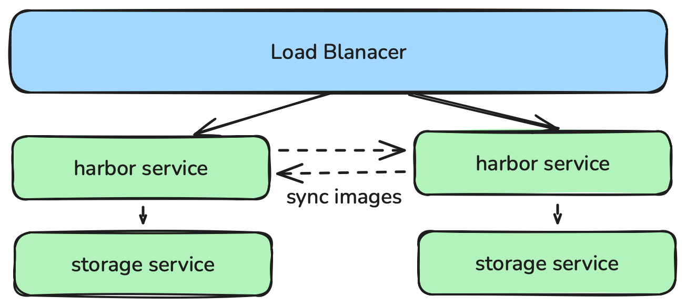
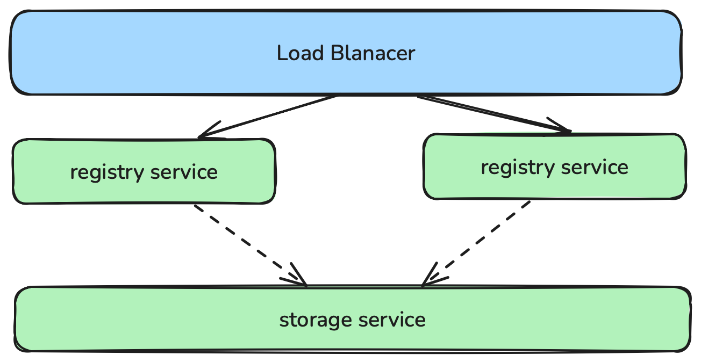

# image_registry

本节介绍如何单独安装私有镜像仓库。通过 docker-compose 安装镜像仓库，支持 `harbor` 和 `docker-registry` 两种类型。

安装过程中依赖 tar 工具实现软件包的压缩、解压处理，同时 Docker 服务依赖 iptables 管理容器网络规则，请提前确认系统环境已预装上述命令。

## requirement

- 一台或多台运行兼容 deb/rpm 的 Linux 操作系统的计算机；例如：Ubuntu 或 CentOS。
- 每台机器 8 GB 以上的内存，内存不足时应用会受限制。
- 用作控制平面节点的计算机上至少有 4 个 CPU。
- 集群中所有计算机之间具有完全的网络连接。你可以使用公共网络或专用网络
- 使用本地存储时。计算机需要100G高速存储的磁盘空间。  

## 安装harbor

### 构建Inventory
```yaml
apiVersion: kubekey.kubesphere.io/v1
kind: Inventory
metadata:
  name: default
spec:
  hosts: # your can set all nodes here. or set nodes on special groups.
    harbor1:
      connetor:
        host: 172.16.66.6
      internal_ipv4: 172.16.66.6
    # harbor2:
    #   connector:
    #     host: 172.16.66.7
    #     private_key: ~/.ssh/id_rsa
    #   internal_ipv4: 172.16.66.6
  groups:
    image_registry:
      hosts:
        - harbor1
  vars:
    zone: cn
    image_registry:
      type: harbor
      auth:
        registry: dockerhub.kubekey.local
        # plain_http: false
        password: Harbor12345

```

| 字段 | 类型 | 必填 | 说明 |
|------|------|------|------|
| `spec.hosts` | Object | 是 | 主机列表，key 为主机名称，value 为主机配置 |
| `spec.hosts.<name>.connector` | Object | 是 | 主机连接配置 |
| `spec.hosts.<name>.connector.host` | String | 是 | SSH 目标主机 IP 或域名 |
| `spec.hosts.<name>.connector.private_key` | String | 否 | SSH 私钥路径，默认使用系统默认密钥 |
| `spec.hosts.<name>.internal_ipv4` | String | 否 | 主机内部 IPv4 地址，会应用于/etc/hosts域名解析 |
| `spec.groups` | Object | 是 | 节点分组配置 |
| `spec.groups.image_registry` | Object | 是 | 镜像仓库节点组，指定哪些主机用于部署镜像仓库 |
| `spec.groups.image_registry.hosts` | Array | 是 | 镜像仓库节点名称列表 |
| `spec.vars` | Object | 否 | 全局变量配置 |
| `spec.vars.zone` | boolean | 否 | 文件及镜像的下载区域。如果您访问 GitHub/GoogleAPIs 受限，请将该值设置为cn |
| `spec.vars.image_registry` | Object | 否 | 镜像仓库相关配置 |
| `spec.vars.image_registry.type` | String | 否 | 镜像仓库类型，可选 `harbor` 或 `docker-registry` |
| `spec.vars.image_registry.harbor.http_port` | Integer | 否 | Harbor HTTP 服务端口。`plain_http=true` 时默认从 `auth.registry` 派生，未指定端口则为 `80`；`plain_http=false` 时为空 |
| `spec.vars.image_registry.harbor.https_port` | Integer | 否 | Harbor HTTPS 服务端口。`plain_http=false` 时默认从 `auth.registry` 派生，未指定端口则为 `443`；`plain_http=true` 时为空 |
| `spec.vars.image_registry.auth` | Object | 否 | 镜像仓库认证配置 |
| `spec.vars.image_registry.auth.plain_http` | Boolean | 否 | 是否使用纯 HTTP（不启用 TLS），默认为 `false` |
| `spec.vars.image_registry.auth.registry` | String | 否 | 镜像仓库域名，格式 `host:port/project`，端口会用于派生 Harbor 监听端口 |
| `spec.vars.image_registry.auth.password` | String | 否 | 镜像仓库登录密码，默认为Harbor12345 |

### 安装
harbor是默认安装的镜像仓库
1. 安装前检查
    ```shell
    kk precheck image_registry -i inventory.yaml
    ```
2. 安装

```shell
kk init registry -i inventory.yaml
```

### harbor高可用

harbor高可用有两种实现方式。

1. 每个harbor共享同一个存储服务。
官方做法，适用于在kubernetes集群中安装。需要独立部署PostgreSQL 和 Redis 服务    
参考：https://goharbor.io/docs/edge/install-config/harbor-ha-helm/

2. 每个harbor有单独的存储服务。
kubekey的做法，适用于在服务器上安装。

- load balancer: 通过docker compose部署keepalived服务实现。
- harbor service: 通过docker compose部署harbor实现。
- sync images: 通过harbor的复制管理功能实现。

#### 在 inventory.yaml 文件添加高可用配置
```yaml!
apiVersion: kubekey.kubesphere.io/v1
kind: Inventory
metadata:
  name: default
spec:
  hosts: # your can set all nodes here. or set nodes on special groups.
    harbor1:
      connector:
        host: 172.16.66.6
      internal_ipv4: 172.16.66.6
    harbor2:
      connector:
        host: 172.16.66.7
        private_key: /root/.ssh/id_rsa
      internal_ipv4: 172.16.66.7
  groups:
    image_registry:
      hosts:
        - harbor1
        - harbor2
  vars:
    zone: cn
    image_registry:
      ha_vip: 172.16.66.8
      type: harbor
      auth:
        registry: dockerhub.kubekey.local
        # plain_http: false
```

Inventory 字段解释：

| 字段 | 类型 | 必填 | 说明 |
|------|------|------|------|
| `spec.hosts` | Object | 是 | 主机列表，key 为主机名称，value 为主机配置 |
| `spec.hosts.<name>.connector` | Object | 是 | 主机连接配置 |
| `spec.hosts.<name>.connector.host` | String | 是 | SSH 目标主机 IP 或域名 |
| `spec.hosts.<name>.connector.private_key` | String | 否 | SSH 私钥路径，默认使用系统默认密钥 |
| `spec.hosts.<name>.internal_ipv4` | String | 否 | 主机内部 IPv4 地址，会应用于 `/etc/hosts` 域名解析 |
| `spec.groups` | Object | 是 | 节点分组配置 |
| `spec.groups.image_registry` | Object | 是 | 镜像仓库节点组，指定哪些主机用于部署镜像仓库 |
| `spec.groups.image_registry.hosts` | Array | 是 | 镜像仓库节点名称列表，高可用需配置 2 个及以上节点 |
| `spec.vars` | Object | 否 | 全局变量配置 |
| `spec.vars.zone` | String | 否 | 文件及镜像的下载区域。如果您访问 GitHub/GoogleAPIs 受限，请将该值设置为 `cn` |
| `spec.vars.image_registry` | Object | 否 | 镜像仓库相关配置 |
| `spec.vars.image_registry.ha_vip` | String | 是（高可用场景） | 负载均衡虚 IP，作为镜像仓库的统一访问入口 |
| `spec.vars.image_registry.type` | String | 否 | 镜像仓库类型，可选 `harbor` 或 `docker-registry` |
| `spec.vars.image_registry.harbor.http_port` | Integer | 否 | Harbor HTTP 服务端口。`plain_http=true` 时默认从 `auth.registry` 派生，未指定端口则为 `80`；`plain_http=false` 时为空 |
| `spec.vars.image_registry.harbor.https_port` | Integer | 否 | Harbor HTTPS 服务端口。`plain_http=false` 时默认从 `auth.registry` 派生，未指定端口则为 `443`；`plain_http=true` 时为空 |
| `spec.vars.image_registry.auth` | Object | 否 | 镜像仓库认证配置 |
| `spec.vars.image_registry.auth.plain_http` | Boolean | 否 | 是否使用纯 HTTP（不启用 TLS），默认为 `false` |
| `spec.vars.image_registry.auth.registry` | String | 否 | 镜像仓库访问域名，对应 VIP 的域名，供外部客户端访问使用。格式 `host:port/project`，端口会用于派生 Harbor 监听端口。（实际部署的 Harbor 以 inventory_hostname 作为内部域名）|

> **高可用配置注意事项：**
> - `image_registry` 组中需设置多个节点，用于实现多实例部署。
> - `ha_vip` 必须与各节点处于同一网段，并保持未被占用。

执行名称创建高可用harbor集群
```shell
./kk init registry -i inventory.yaml 
```

## 安装 registry

### 构建 Inventory

```yaml
apiVersion: kubekey.kubesphere.io/v1
kind: Inventory
metadata:
  name: default
spec:
  hosts:
    # localhost:
    #   connector:
    #     password: 123456
    # node1:
    #   connector:
    #     type: ssh
    #     host: node1
    #     port: 22
    #     user: root
    #     password: 123456
  groups:
    k8s_cluster:
      groups:
        - kube_control_plane
        - kube_worker
    kube_control_plane:
      hosts:
        - localhost
    kube_worker:
      hosts:
        - localhost
    etcd:
      hosts:
        - localhost
    image_registry:
      hosts:
        - localhost
#    nfs:
#      hosts:
#        - localhost
```

### 构建 Registry 镜像包

KubeKey 不自带离线 registry 镜像包，需要手动打包。

```shell
# 下载 registry 镜像
docker pull registry:{{ .docker_registry_version }}
# 打包镜像
docker save -o docker-registry-{{ .docker_registry_version }}-linux-{{ .binary_type }}.tgz registry:{{ .docker_registry_version }}
# 将镜像移到工作目录
mv docker-registry-{{ .docker_registry_version }}-linux-{{ .binary_type }}.tgz {{ .binary_dir }}/image-registry/docker-registry/{{ .docker_registry_version }}/{{ .binary_type }}/
```

- `binary_type`：机器架构（amd64 或 arm64，通过 `gather_fact` 自动检测）
- `binary_dir`：软件包存放路径，通常为 `{{ .work_dir }}/kubekey`。

### 安装

将 `image_registry.type` 设置为 `docker-registry` 以安装 registry。

1. 安装前检查
```shell
kk precheck image_registry -i inventory.yaml --set image_registry.type=docker-registry --set docker_registry_version=2.8.3,docker_version=24.0.7,dockercompose_version=v2.20.3
```

2. 安装
- 单独安装
```shell
kk init registry -i inventory.yaml --set image_registry.type=docker-registry --set docker_registry_version=2.8.3,docker_version=24.0.7,dockercompose_version=v2.20.3 --set artifact.artifact_url.docker_registry.amd64=docker-registry-2.8.3-linux.amd64.tgz
```

- 创建集群时自动安装
```shell
kk create cluster -i inventory.yaml --set image_registry.type=docker-registry --set docker_registry_version=2.8.3,docker_version=24.0.7,dockercompose_version=v2.20.3 --set artifact.artifact_url.docker_registry.amd64=docker-registry-2.8.3-linux.amd64.tgz
```

### registry高可用


- load balancer: 通过docker compose部署keepalived服务实现。
- registry service: 通过docker compose部署registry实现。
- storage service: docker-registry 高可用可通过共享存储的方式来实现。docker-registry 支持多种存储后端，常见的有：
  - **filesystem**: 本地存储。默认情况下，docker-registry 使用本地磁盘存储镜像数据。如果需要实现高可用，可以将本地存储目 录挂载到 NFS 等共享存储上。配置示例：
      ```yaml
      image_registry:
        docker_registry:
          storage:
            filesystem:
              rootdir: /opt/docker-registry/data
              nfs_mount: /repository/docker-registry # 可选，将 rootdir 挂载到 NFS 服务器
      ```
      需要在 `nfs` 节点配置和挂载好共享目录，保证所有 registry 实例的数据一致性。
  
  - **azure**: 使用 Azure Blob Storage 作为后端存储。适用于部署在 Azure 云环境下的场景。配置示例：
      ```yaml
      image_registry:
        docker_registry:
          storage:
            azure:
              accountname: <your-account-name>
              accountkey: <your-account-key>
              container: <your-container-name>
      ```
  
  - **gcs**: 使用 Google Cloud Storage 作为后端存储。适用于部署在 GCP 云环境下的场景。配置示例：
      ```yaml
      image_registry:
        docker_registry:
          storage:
            gcs:
              bucket: <your-bucket-name>
              keyfile: /path/to/keyfile.json
      ```
  
  - **s3**: 使用 Amazon S3 或兼容 S3 协议的对象存储作为后端存储。适用于 AWS 或支持 S3 协议的私有云。配置示例：
      ```yaml
      image_registry:
        docker_registry:
          storage:
            s3:
              accesskey: <your-access-key>
              secretkey: <your-secret-key>
              region: <your-region>
              bucket: <your-bucket-name>
      ```

> **注意：**  
> 1. 使用共享存储（如 NFS、S3、GCS、Azure Blob）时，建议至少部署 2 个及以上 registry 实例，并通过负载均衡（如 keepalived+nginx）实现高可用访问。  
> 2. 配置共享存储时，需保证各 registry 节点对存储的读写权限和网络连通性。  
 
## 卸载私有镜像仓库

```shell
./kk delete registry -i inventory.yaml --all --with-data
```

| 参数 | 说明 |
|------|------|
| `--all` | 卸载所有其他相关组件，包括 Docker 服务, DNS 配置 |
| `--with-data` | 同时删除镜像仓库的数据目录（如 Harbor 数据、registry 存储），不携带则保留数据 |
